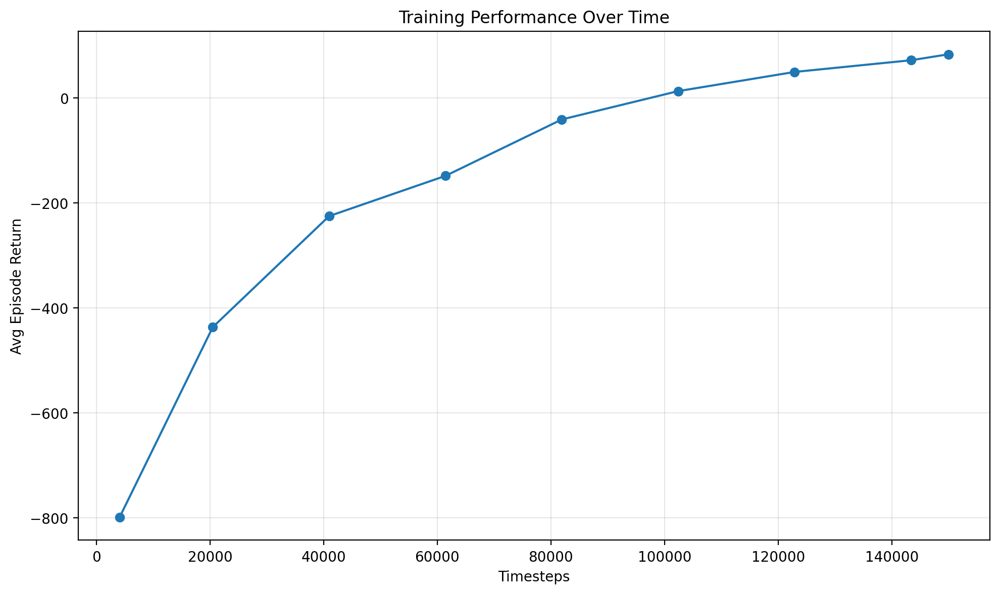

# Autonomous energy management system for EV charging sites


## Overview

Modern EV charging sites are increasingly deployed with local solar and battery storage. Operating these systems well is hard because the controller must continuously balance competing objectives:

- serve as much EV demand as possible,
- reduce costly grid imports during high-price periods,
- use the battery strategically,
- export excess solar when profitable,
- avoid excessive battery cycling,
- remain smooth and stable in control decisions.

This project formulates that problem as a **continuous-control reinforcement learning task** and trains a **Proximal Policy Optimization (PPO)** agent to manage the site over a daily operating horizon.

Each episode represents a full day at **15-minute resolution**. At each timestep, the agent chooses:

1. battery dispatch,
2. charging allocation,
3. grid exchange preference.

The environment then simulates site power balance, cost/revenue, battery state of charge, and service quality.

---

## Problem formulation

### Objective

Train an RL agent to operate an EV charging site that minimizes total operating cost while maintaining service quality.

### System components

The simulated site includes:

- **EV charging demand**
- **solar generation**
- **grid import/export**
- **battery storage**

### Trade-offs the agent learns

The agent must learn when to:

- charge the battery using cheap energy or solar surplus,
- discharge the battery to reduce expensive grid purchases,
- serve more or less instantaneous EV demand depending on economics and constraints,
- export surplus solar energy,
- avoid unstable or overly aggressive control actions.

---

## Environment design

Each episode is one day:

- **96 timesteps**
- **15 minutes per step**
- **24 hours total**

The environment creates stochastic daily profiles for:

- electricity price,
- solar generation,
- EV demand.

This means the policy must learn a **general operating strategy**, not memorize a single deterministic schedule.

### Observation space

The state includes:

- sine/cosine time-of-day encoding,
- current electricity price,
- current solar generation,
- current EV charging demand,
- battery state of charge,
- previous battery action,
- previous charging action,
- rolling average price,
- rolling average demand.

These features give the agent both instantaneous context and some short-term temporal signal.

### Action space

The agent outputs 3 continuous actions in `[-1, 1]`:

1. **Battery dispatch**
   - `-1`: maximum discharge
   - `+1`: maximum charge

2. **Charging allocation factor**
   - `-1`: serve none of current demand
   - `+1`: serve all current demand

3. **Grid exchange bias**
   - `-1`: prefer export when surplus exists
   - `+1`: prefer import when deficit exists

### Reward function

The reward is designed around real operational economics.

The agent is penalized for:

- grid import cost,
- unmet EV charging demand,
- battery degradation from cycling,
- abrupt action changes.

The agent is rewarded through:

- export revenue when excess energy is sold back to the grid.

Formally, reward is the negative of:

- import cost
- unmet demand penalty
- battery degradation cost
- smoothing penalty

plus export revenue.

This gives a meaningful optimization objective: operate the site profitably while maintaining charging service.

---

## PPO agent

The learning algorithm is **Proximal Policy Optimization (PPO)** implemented directly in PyTorch.

### Model structure

The actor-critic network uses:

- shared MLP encoder,
- policy head for continuous actions,
- value head for state value estimation,
- learned log standard deviation for Gaussian exploration.

### PPO details

The implementation includes:

- clipped policy objective,
- generalized advantage estimation (GAE),
- entropy bonus,
- value loss,
- gradient clipping,
- tanh-squashed continuous actions.

This keeps the code educational and self-contained while still being strong enough to solve the task.

---

## Repository structure

```text
ev-charging-rl/
├── README.md
├── requirements.txt
├── train.py
├── evaluate.py
├── envs/
│   └── ev_charging_env.py
├── agents/
│   └── ppo_agent.py
└── utils/
    └── seed.py
```

## Installation 

To create a virtual environment on MacOS or Linux: 

```bash
python3 -m venv .venv
source .venv/bin/activate
```

To create a virtual environment on Windows:
```bash
.venv\Scripts\activate
```

## Training Instructions 

To begin training the model:

```bash
python3 train.py
```

Doing this will:

	• Initialize the custom EV charging environment
	• Train a PPO agent
	• Print update metrics during training
	• Save checkpoints in checkpoints/

During training, checkpoints are saved to:

```text
checkpoints/ppo_ev_charging.pt
```

The final model is saved to: 

```text
checkpoints/ppo_ev_charging_final.pt
```

## Evaluation Instructions 

To evaluate the final model:

```bash
python evaluate.py
``` 

Doing this will:
	
    • Load the trained model
	• Evaluate it over multiple episodes
	• Print episodic returns
	• Generate plots 

## Visualizations 

The generated plots visualize:

    • Demand vs served load vs solar
	• Electricity price
	• Battery state of charge
	• Grid import/export
	• Unmet charging demand

## Results 

Training was run for 150,000 timesteps.

The PPO agent improved substantially over training:

	• Early training began with very poor returns, around -799 average episodic return.
	• Returns steadily improved as the agent learned basic operating behavior.
	• Performance crossed into positive average return by update 25.
	• Final training reached 83.403 average episodic return by the last update.

Key training milestones included:

| Update | Timesteps | Avg Episode Return |
|---|---:|---:|
| 1 | 4,096 | -798.859 |
| 5 | 20,480 | -436.741 |
| 10 | 40,960 | -225.108 |
| 15 | 61,440 | -148.365 |
| 20 | 81,920 | -40.860 |
| 25 | 102,400 | 13.153 |
| 30 | 122,880 | 49.689 |
| 35 | 143,360 | 71.989 |
| 37 | 150,000 | 83.403 |



## Conclusion 

The final results demonstrate that the agent learns a materially better operating strategy over time, transitioning from highly negative returns to consistently positive evaluation performance.
